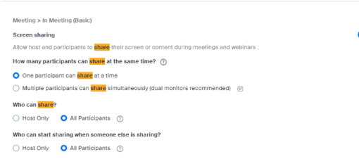
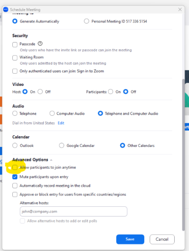

3/31/2023
## Deploy Capstone Site using Zoom Links

### **Capstone Website:** *your website url*
### **Project Code:** *get from repo*
### **Netlify Account:** *your netlify account information - see below for directions*

### Your capstone teams need to provide:
1. Team Name
2. Project Name
3. Thumbnail Logo
4. Team member names with associated LinkedIn URL

### **Details**
Capstone-expo is data-driven by a JSON file in Public/Data/ *.JSON 
Example is in NLRdata11.json  -- Each team needs its OWN zoom link.  

### **Zoom Links**
Each TE staff member can create 2 links that are allowed to run simultaneously.  Each staff member goes to Zoom.us and schedule 2 meetings (preferably no password or have it embedded).  Each meeting needs to be able to
- share screens
 
- be started without the host present


I HIGHLY recommend you test this before hand to verify each team’s zoom link works (we test it at noon on the Thursday before capstones – all team members need to into the zoom and verify they can make it in and can share screens). 


Alter SRC/Store/index.js to reference new file created in public/data/*.json


Netify account has been created (credentials above)
Mostly need to complete JSON file, change router reference, and deploy

If you wish to record a HELP video, do so and store it in google drive and modify the MainTop.vue file (in the iFrame modify the src).


## Preferred setup steps (using Netlify) (modified 7/12/20201 JWF)

1. Create a free account at netlify.com.

2. Setup jitsi.org meeting room for welcome center (CBUS is using CapstoneExpoCBUS)

3. Setup jitsi meeting rooms for each team. CBUS uses team name like Alpha, Brave, Charlie, etc, so we set up jitsi.org team rooms with name like TeamAlphaCBUS, TeamBravoCBUS, etc. In the data, the jitsi names should be the link name

4. (optional) Create name shorteners with tracking (bit.ly, tiny.cc, etc.) for each team meeting room to simplify gathering data about numbers of visits to each room. In the data, the name shortener names should be the quickLink name.

5. Download the vue.js application from bitbucket (https://bitbucket.org/te-curriculum/capstone_expo/). Modify the data.json file for your local location. If you created bit.ly links, use them as the main link (quickLink).

7. Type `npm run build` to generate a `dist` directory.

8. Open https://app.netlify.com in your browser and drag the `dist` directory created in step 7 into the box labeled, "Want to deploy a new site without connecting to Git? Drag and drop your site folder here".

9. The app will now be deployed with a randomly generated name. To change the name, click the Site Settings button, and then the "Change Site Name" button.


## Alternate setup steps (using a purchased domain name and SSL certificate)

1. Lease domain name (suggested source, namecheap.com). CBUS is using cbus-capstone.


2. Secure hosting (free, from freehostia.com and elsewhere)


3. Once domain name is pointed at hosting (add hosting nameservers to domain name setup), wait for DNS to resolve (2 to 72 hours) 


4. Setup jitsi.org meeting room for welcome center (CBUS is using CapstoneExpoCBUS)


5. Setup jitsi meeting rooms for each team. CBUS uses team name like Alpha, Brave, Charlie, etc, so we set up jitsi.org team rooms with name like TeamAlphaCBUS, TeamBravoCBUS, etc. In the data, the jitsi names should be the link name


6. (optional) Create name shorteners with tracking (bit.ly, tiny.cc, etc.) for each team meeting room to simplify gathering data about numbers of visits to each room. In the data, the name shortener names should be the quickLink name. In the data, teams can have a quickLink


7. Download the vue.js application from bitbucket (https://bitbucket.org/te-curriculum/capstone_expo/). 
   
8. Modify the data.json file for your local location and cohort. 
   
9. If you created bit.ly links, use them as the main link (quickLink) and the jitsi.org links and the secondary links (link).
   
10. Modify the .htacess for the selected domain names.


8. Use ftp to push the vue.js distribution for html, css, and js to server11(suggested program, filezilla)


12.  Test with http


13. Secure SSL certificate for host and test with https. Https is required for the page to be able to use the camera and microphone. Getting the certificate from the hosting provider usually simplifys the installation.


14. Total out-of-pocket cost ~$40, good for 1 year


# Questions, setup assistance, bug reports
```
John Fulton
john@techelevator.com
614-565-8382
```


